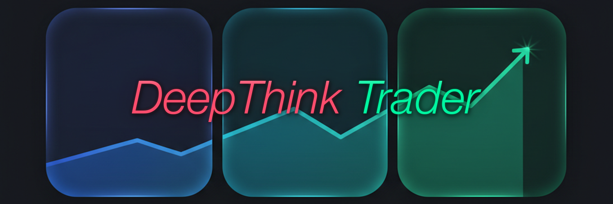

{width=100%}

# Introduction

This guide documents how DeepThink Trader evaluates candidate stocks and executes paper trades. It's written for operators who need to understand the decision path — what the bot looks at, what gates a trade has to clear, and what drives exits.

All claims are sourced from the current codebase; file and line references accompany each section so the claim can be verified against the source.

The system is **paper-trading only**. Nothing in this document is a recommendation. Every user runs on their own Alpaca paper account, and all risk gates are calibrated around capital preservation, not performance maximization.

---

# Cycle orchestration

`main.py:BotOrchestrator` is the entry point. It iterates over every user who is `enabled=true` in the `users` table AND has Alpaca keys in `user_secrets`, and runs one research cycle per portfolio per user.

| Parameter | Value | Source |
|---|---|---|
| Research cycle interval | **15 minutes** | `RESEARCH_INTERVAL_MINUTES` (`main.py:570`) |
| Exit check interval | **5 minutes** | `EXIT_CHECK_INTERVAL_MINUTES` (`main.py:571`) |
| Active user lookup | `db.get_active_user_ids()` | `main.py:478` |
| Per-user Alpaca client | fresh `DeepThinkTrader` instance | `main.py:495–502` |
| Portfolios per user | `main` + `penny` (if `PENNY_ENABLED=true`) | `main.py:505–507` |

Before any user runs, a global pre-check uses the *first* active user's Alpaca keys to query the market clock. If the market is closed, the cycle logs `Market closed — skipping cycle` and returns. If the market is open, cycles run for each user in sequence.

**Startup reconciliation.** On every bot start, `execution.reconcile_open_trades()` (`execution_agent.py:911–938`) compares rows in the `trades` table with `status='OPEN'` against live Alpaca positions. If the DB thinks a position is open but Alpaca doesn't, the trade is closed in the DB using the actual exit-order fill price (via `/v2/orders?status=closed`) or a yfinance fallback. The line `Startup reconcile: 0 OPEN trades match Alpaca — no ghosts` confirms the DB is consistent with the broker.

---

# Scanner — 3-stage funnel

`agents/scanner_agent.py` turns the ~12,000-symbol US equity universe into a short list per cycle. It's a three-stage pipeline: discovery → liquidity → scoring.

## Stage 1 — Discovery (`scanner_agent.py:421–451`)

Pulls candidate tickers from four parallel signals:

- `_discover_most_active()` — top 50 by day's volume
- `_discover_top_movers()` — top 50 gainers + top 50 losers
- `_discover_news_trending()` — 20 tickers from NewsAPI, last 12 hours, popularity-sorted
- SA RSS trending bonus — tickers appearing 2+ times in the Seeking Alpha RSS feed
- Popular stocks (~90 large/mid caps) get `+1` discovery-source bonus

## Stage 2 — Liquidity filter (`scanner_agent.py:454–468`)

A single Alpaca snapshot call batches the entire tradeable universe and applies hard price/volume gates:

| Filter | Main | Penny |
|---|---|---|
| Min price | $5 | $1 |
| Max price | $5,000 | $5 |
| Min avg daily volume | 200K | 500K |

After Stage 2, ~5,000 candidates remain for the main portfolio scanner.

## Stage 3 — Scoring (`scanner_agent.py:470–567`)

For each survivor, the scanner fetches 90 days of weekly bars and 30 days of daily bars, then computes a composite score (0–115):

| Component | Points | Gate |
|---|---|---|
| Relative strength vs SPY 4-week | 0–30 | `-5%` minimum (`SCANNER_MIN_REL_STRENGTH`) |
| Weekly uptrend (price > 10-week SMA) | 20 | — |
| Volume ratio today/prev | 0–20 | `≥1.5×` (`SCANNER_MIN_RVOL`) |
| Discovery source count | 0–15 | `≥1` signal |
| Daily momentum (positive change) | 0–15 | — |
| RSI momentum (14-day) | –5 to +15 | bonus zones: 30–40 oversold +15, 50–65 momentum +12, >75 overbought –5 |

Top `SCANNER_TOP_N` (default 20 main, 15 penny, `config.py:138–151`) pass through to the research phase.

**Penny differences** (`scanner_agent.py:570–705`): skips the relative-strength gate (penny stocks are volatile against SPY), weights volume spike (0–30) and daily momentum (0–25) heavier.

---

# Research agent — what we know about each ticker

`agents/research_agent.py:generate_report` (lines 321–745) produces a structured report per ticker, pulling from 9 data sources in parallel.

| # | Source | What it returns |
|---|---|---|
| 1 | **NewsAPI** (`:92–124`) | 5 articles, 24h, VADER sentiment → `impact_score` –10 to +10 |
| 2 | **Multi-source news** (`:349–367`) | StockNewsAPI + TickerTick + AlphaVantage + FMP + Marketaux |
| 3 | **Reddit** (`:126–204`) | r/wallstreetbets, r/stocks, r/investing — VADER on titles + top 5 comments |
| 4 | **Technicals** (`:206–263`) | Alpaca snapshot → yfinance fallback (price, vol, SMA-10/20, RSI-14, 52w hi/lo) |
| 5 | **Advanced technicals** (`:374–380`) | Twelve Data API (**currently disabled** — rate limits block 15-min cycles) |
| 6 | **Fundamentals** (`:382–387`) | Yahoo Finance (P/E, revenue growth, earnings dates, analyst ratings, insider trades) |
| 7 | **Seeking Alpha** (`:389–432`) | Gmail label ingest + RSS feed, merged sentiment (70% RSS / 30% email) |
| 8 | **Options flow** (`:434–439`) | yfinance unusual activity, 15-min cached |
| 9 | **Market regime** (`:265–310`) | VIX level + 11 sector-ETF advance/decline ratio |

## Sentiment composition

Final catalyst score is a weighted blend (`:542–551`) whose weights rebalance when sources are unavailable:

| Source | Base weight |
|---|---|
| News (NewsAPI + aggregator blend, 40/60) | 20–25% |
| Reddit | 10–15% |
| Options flow | 15% |
| Basic technicals | 20–30% |
| Advanced technicals | 20–30% |
| Seeking Alpha | 15–20% |

## Caching

Research reports are cached per-ticker with a 4-hour TTL, invalidated early if price moves >2% (`:315–343`). This keeps the free NewsAPI tier viable under multi-user load.

---

# DeepThink AI — conviction + edges

The evaluation layer combines a rule-based scoring function (`agents/deepthink_agent.py`) with a Claude call (`utils/claude_analyst.py`) that reviews the full data packet and can nudge conviction or override the action.

## Claude model + prompt

| Parameter | Value |
|---|---|
| Model | `claude-haiku-4-5-20251001` (`config.py:83`) |
| Max output tokens | 1,024 (`claude_analyst.py:50`) |
| Prompt caching | `cache_control: ephemeral` (`:62`) |
| System role | "senior equity analyst… catch what numbers miss" |

Claude returns JSON with `conviction_adjustment` (–2 to +2), optional `action_override`, `qualitative_assessment`, and `confidence` (0–1). The adjustment is scaled by confidence and only applied if `|adjustment| > 0.1` (`deepthink_agent.py:564–572`).

## Conviction formula (`deepthink_agent.py:269–292`)

```
base      = (bull_strength / total_signals) × 10
bonus     = (strong_bull − strong_bear) × 0.5     # strength ≥6 counts as "strong"
catalyst  = combined_catalyst_score × 5
conviction = clamp(base + bonus + catalyst, 1, 10)
```

## The three edges

A trade must have at least `MIN_EDGES_REQUIRED` (default **2 of 3**) edges firing to proceed.

### Edge 1 — Fundamental (2 of 5)

- P/E below sector average **or** revenue growth >10%
- Analyst upside to target >10%
- Positive free cash flow
- Insider net buying in last 30 days
- Earnings beat streak (3 of last 4 quarters)

### Edge 2 — Technical (`:296–327`, 2 of 3)

- Price > 200-day SMA
- RSI-14 < 45 (oversold or neutral-bullish)
- Volume > 1.5× 20-day average

### Edge 3 — Sentiment / Regime (`:329–375`, 2 of 6)

- Combined catalyst > 0.2
- News sentiment > 2/10
- Reddit sentiment > 0.3
- VIX < 20 (favorable) **or** VIX ≥ 25 (penalty)
- Market breadth ≥60% sectors advancing **or** ≤30% (penalty)

## Optional Bull/Bear debate

If `DEBATE_ENABLED=true` (default), an adversarial 2-round debate runs between Bull and Bear Claude personas. The judge blends rule-based conviction (60%) + debate conviction (40%). A conviction ≥7.0 can trigger an action override (`:524–550`).

## Historical edge-combo lookup

Before returning, `deepthink_agent.py:492–507` queries the `edge_performance` table for the specific combo (e.g. `F+T`, `T+S`). If that combo has:

- **>65% win rate**: conviction **+1.5**
- **<35% win rate**: conviction **–1.5**

This is the feedback loop that lets the system learn which edge combinations are working in the current regime.

---

# Risk manager — the 16 pre-trade checks

Every candidate that clears DeepThink is handed to `RiskManager.validate_trade()` (`utils/risk_manager.py:729–788`). All 16 gates must pass or the trade is blocked.

| # | Check | Rule | Config |
|---|---|---|---|
| 0 | Warmup | ≥100 unique tickers analyzed | `WARMUP_MIN_TICKERS` |
| 1 | Conviction | `conviction ≥ MIN_CONVICTION` | 7.5 normal / 9.0 safe / 6.0 aggressive |
| 2 | Risk limit | `stop_loss_pct ≤ 5× MAX_RISK_PER_TRADE` | 2% normal → 10% cap |
| 3 | Reward:Risk | `TP% / SL% ≥ MIN_REWARD_RISK_RATIO − 0.01` | 2:1 / 3:1 / 1.5:1 |
| 4 | Daily loss | today's realized > `−MAX_DAILY_LOSS × equity` | 5% normal |
| 5 | Open positions | < `MAX_OPEN_POSITIONS` | 10 / 5 / 15 |
| 6 | Duplicate | no existing open position in ticker | — |
| 7 | Market hours | Alpaca clock says open | — |
| 8 | Drawdown halt | 30-day peak-to-current < `MAX_DRAWDOWN_HALT_PCT` | 8% |
| 9 | Risk of ruin | `e^(−2·edge·capital / risk²) < 1%` | `MAX_RISK_OF_RUIN_PCT` |
| 10 | Liquidity | `shares < ADV / MIN_ADV_RATIO` | ADV/5 |
| 11 | Edges firing | `edges ≥ MIN_EDGES_REQUIRED` | 2 |
| 12 | Market health | SPY > −2% (longs) **and** VIX < 30 (all) | `CIRCUIT_BREAKER_*` |
| 13 | Earnings proximity | NOT within `EARNINGS_EXIT_DAYS` OR <12h | 2 days |
| 14 | Bid/ask spread | < `MAX_SPREAD_PCT` | 1.0% main / 2.0% penny |
| 15 | Sector concentration | post-trade sector exposure < 25% | `MAX_SECTOR_EXPOSURE_PCT` |

A failed gate returns a structured block reason that surfaces in the Risk Dashboard page.

## Position sizing — half-Kelly with Bayesian shrinkage

`calculate_position_size()` (`risk_manager.py:54–109, 135–177`) uses:

```
p_shrunk = (wins + 20) / (wins + losses + 40)     # Beta(20,20) prior
q_shrunk = 1 − p_shrunk
f*       = [(p_shrunk − q_shrunk) / payoff_ratio] × safety_multiplier
```

- **Safety multiplier**: 0.25 when N<50 trades, 0.5 thereafter (`KELLY_SAFETY_MULTIPLIER`)
- **Fallback**: fixed 1% `RISK_PCT_PER_TRADE` until the user has ≥20 closed trades (too little data for a meaningful Kelly)
- **Correlation scaling**: if `average_correlation()` > threshold, position size is multiplied by 0.5 so correlated candidates don't stack the same exposure

---

# Execution

`agents/execution_agent.py:execute()` (lines 317–663) places orders against the per-user Alpaca API.

## Order routing

| Portfolio | Order type | TIF | Slippage buffer |
|---|---|---|---|
| Main | market | day | — |
| Penny | limit | day | ±0.5% (`PENNY_LIMIT_SLIPPAGE_PCT`) |

After submission, the execution agent polls `/v2/orders/{id}` every 2 seconds for up to 30 seconds (`_poll_order_status:667–728`). If the order is rejected/canceled/expired/suspended, it retries as a limit order (`:545–557`). Partial fills automatically adjust the recorded share count (`:558–566`).

## Pre-execution checks

Before sending the POST:

- **Spread check** — `_get_spread_pct()` (`:154–180`) calls `/v2/stocks/{ticker}/snapshot`, extracts the latest quote, blocks if spread exceeds `MAX_SPREAD_PCT`.
- **ADV check** — 20-day volume average; auto-reduces share count if `shares > ADV / MIN_ADV_RATIO` (`:447–450`).
- **Sector concentration** — sums live position values in the same sector (via Yahoo sector lookup), blocks if post-trade exposure would exceed `MAX_SECTOR_EXPOSURE_PCT` (25%).

## Stale order cleanup

`check_pending_orders()` (`:250–274`) cancels limit orders that haven't filled within 30 minutes. Runs at the start of every exit-check cycle.

---

# Exit management

Exit conditions are evaluated every 5 minutes in `check_exit_conditions()` (`execution_agent.py:1057–1330`).

## Trailing stops (`:1115–1147`)

```
activate_at: profit ≥ TRAILING_STOP_ACTIVATION_PCT       # 2.0%
trail_price = highest_price × (1 − TRAILING_STOP_DISTANCE_PCT)
              # 1.5% main, 3.0% penny
```

`highest_price` is refreshed from `max(current_price, daily_high)` (`:1103–1113`) — this prevents losing the trail to an intraday spike that happened between checks.

## Scale-outs (`:1150–1172`)

If `SCALE_OUT_ENABLED=true` (default), the system exits 33% of the *original* position at each R-multiple in `SCALE_OUT_LEVELS`:

| R multiple | Action |
|---|---|
| 1.0 | Sell 33% (now at breakeven on the exited piece) |
| 2.0 | Sell another 33% (locking in 2R on that piece) |
| remaining | Let trail stop or time stop close it |

A floor of "keep ≥1 share" prevents rounding to zero.

## Time stop (`:1205–1215`)

Triggered when `days_held ≥ TIME_STOP_DAYS` (**15 days**) **and** price moved <2% from entry. The "sideways chop" filter keeps winning trades open past day 15; only stagnant ones are cut.

## Earnings proximity (`:1217–1236`)

Two modes, configured via `EARNINGS_EXIT_MODE`:

- **`close`** (default): force-exit if earnings is within 2 days or under 12 hours away
- **`tighten`**: move the stop to 50% of current distance

Blocks new entries under the same window (`risk_manager.check_earnings_proximity`).

---

# Reflection loop — how the system learns

After every full exit (`execution_agent.py:1326`), `reflection_writer.on_trade_closed()` (`:55–76`) does two things:

## 1. Writes a natural-language lesson

The closed trade's thesis, outcome, and exit reason are sent to Claude with a prompt asking for a 1–2 sentence lesson (e.g. "When fundamentals are strong but VIX spikes, entries get wrecked — hold off until VIX < 20 next time"). The result is stored in the `reflections` table. A templated fallback is used if Claude is unreachable.

## 2. Updates `edge_performance`

A row is written per closed trade recording:

- Which edge combo fired (`F+T`, `T+S`, etc.)
- Whether each individual edge passed
- Conviction at entry
- Final P&L
- Won flag

This table is the source of truth for the **edge-combo win-rate lookup** mentioned in the DeepThink section. Combos that win >65% boost conviction +1.5 on future candidates; combos that win <35% get –1.5.

---

# Persistence — what's stored, per-user vs. global

All user-scoped tables include `user_id INTEGER NOT NULL REFERENCES users(id) ON DELETE CASCADE`. Indexes are built on `(user_id, …)` so per-user queries stay fast.

## User-scoped tables

| Table | Purpose | Key columns |
|---|---|---|
| `trades` | All entries + exits | status (OPEN/CLOSED), portfolio, entry/exit prices, trailing_stop, edges_fired, pnl, sector |
| `analysis_results` | Every DeepThink decision | action, conviction, position_size_pct, stop_loss_pct, take_profit_pct, reasoning |
| `research_reports` | Per-ticker research JSON | news_impact_score, reddit_sentiment, combined_catalyst_score |
| `slippage_records` | Expected vs. actual fills | expected_price, filled_price, slippage_pct, hour_of_day |
| `edge_performance` | Feedback loop source | edge_combo, per-edge pass flags, conviction, pnl, won |
| `reflections` | Post-trade lessons | trade_id, thesis, outcome_label, lesson |
| `daily_pnl` | Daily rollup | `UNIQUE(user_id, date)` — realized + unrealized + trade counts |

## Global tables (not user-scoped)

| Table | Purpose |
|---|---|
| `users` | email, name, picture_url, role, enabled flag, created_at |
| `user_secrets` | `user_id PRIMARY KEY`, Fernet-encrypted Alpaca key + secret, `alpaca_key_id_tail` (last-4 for display) |
| `atr_history` | Ticker-level ATR cache, `UNIQUE(ticker, date)` — shared across users since it's market data |
| `alpaca_request_ids` | Audit log of Alpaca X-Request-IDs for debugging fills |

## Multi-tenancy enforcement

- Every save / get method takes a `user_id` parameter explicitly
- The execution agent is constructed per-user with `(db, user_id, api_key, secret_key, risk_manager)` — there's no path for user A's analysis to reach user B's account
- Keys are Fernet-decrypted just-in-time; the decryption key lives in Secret Manager (`trader-fernet-key`) and never touches the DB

---

# Operational notes

## Configuration surface

Most of the thresholds documented here are overridable via environment variables loaded through `config.Config`. Notable ones:

| Env var | Default | Effect |
|---|---|---|
| `TRADE_MODE` | `normal` | flips risk-per-trade, daily loss, conviction minimums |
| `RESEARCH_INTERVAL_MINUTES` | 15 | cycle cadence |
| `CLAUDE_MODEL` | `claude-haiku-4-5-20251001` | model swap for cost/quality |
| `MIN_EDGES_REQUIRED` | 2 | edge confirmation floor |
| `KELLY_SAFETY_MULTIPLIER` | 0.5 | position-size dampener |
| `MAX_DRAWDOWN_HALT_PCT` | 0.08 | halt threshold |
| `CIRCUIT_BREAKER_VIX_THRESHOLD` | 30 | blocks all entries at or above |
| `CIRCUIT_BREAKER_SPY_DROP_PCT` | -2.0 | blocks longs on SPY down-day |
| `PENNY_ENABLED` | true | run penny portfolio alongside main |

## Observability

- **Live Logs page** streams the bot's stdout with severity filters
- **Risk Dashboard** shows current SPY/VIX/circuit-breaker state, sector breadth, pre-trade block reasons
- **Analytics page** shows win rate, expectancy, drawdown curve, edge-contribution over time
- **Trade Detail page** drills into any single trade — edges, research report JSON, exit reason

## Known limitations (as of 2026-04-20)

- Twelve Data advanced-technicals disabled (rate limits incompatible with 15-min cycles)
- Reddit sentiment requires `REDDIT_CLIENT_ID` / `REDDIT_CLIENT_SECRET` — skipped if not set
- Seeking Alpha email ingest expects either the Gmail label `Seeking Alpha` or an Obsidian vault path; neither is required, both feed the same scoring pipe
- Ticker-level research cache (4-hour TTL) is per-process; at N users, Claude and news API quotas burn N× until a shared cache layer is added

---

*Generated 2026-04-20. Parameter values sourced from commit HEAD as of the build date. All file paths are relative to the project root.*
